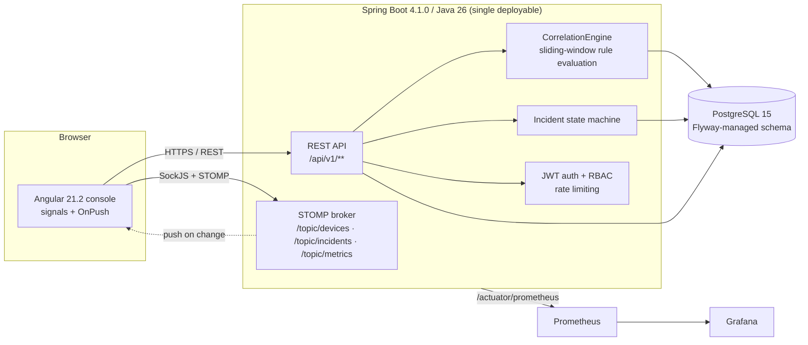
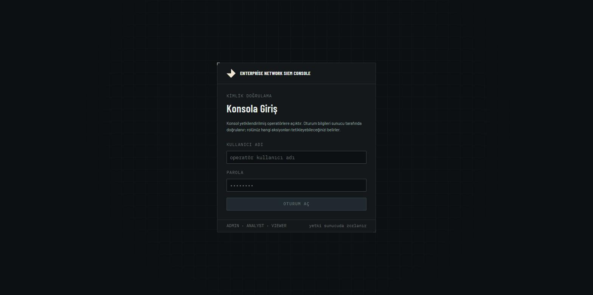
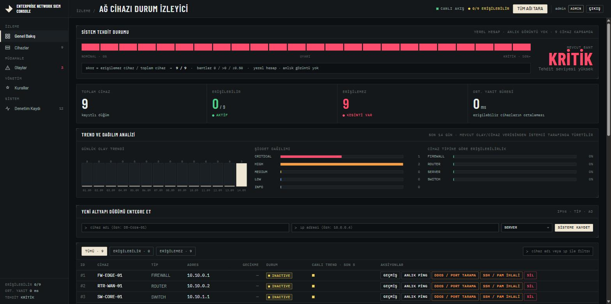
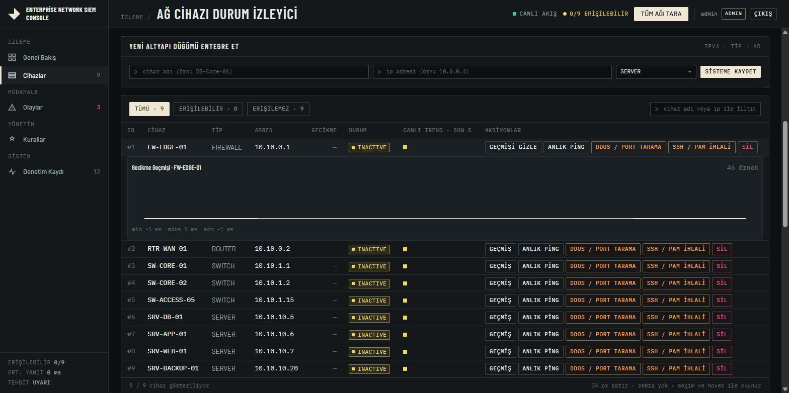
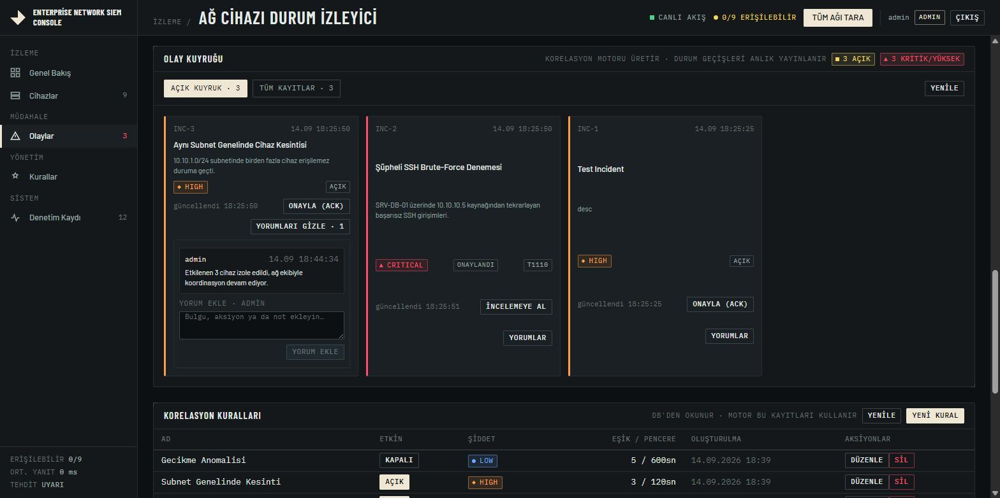
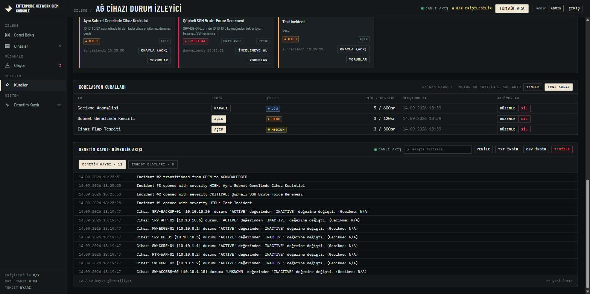
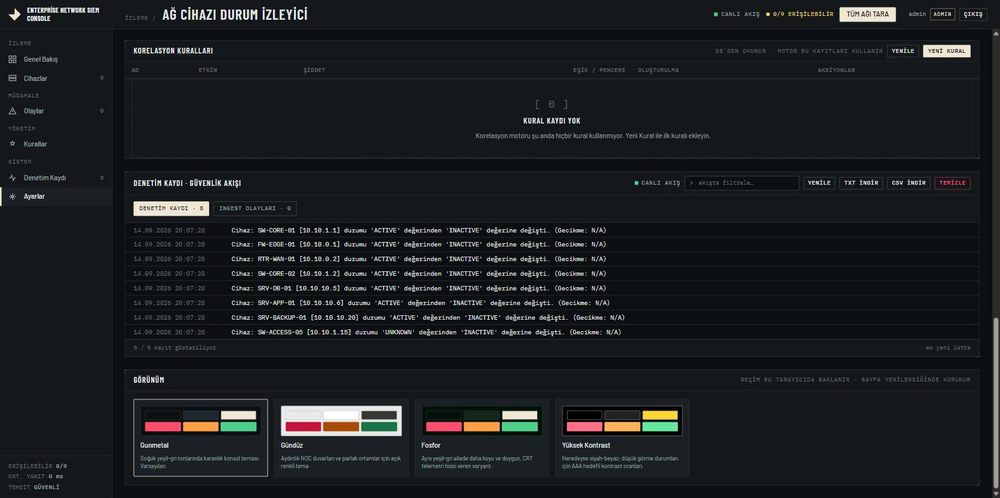
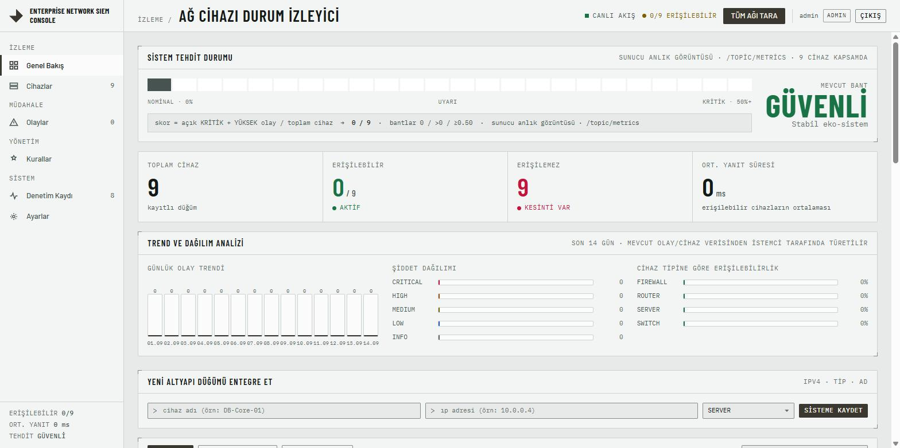
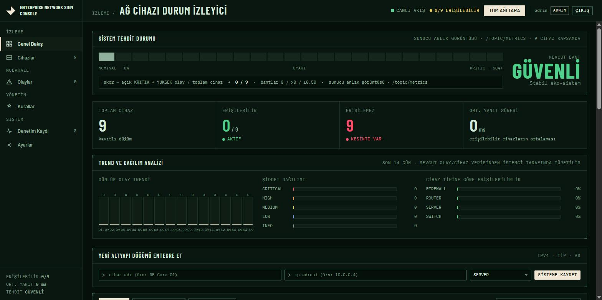
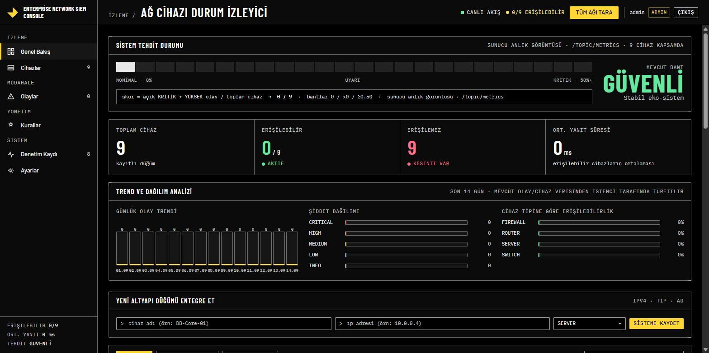

# Enterprise Network SIEM Console

*Turkish [readme.tr.md](readme.tr.md)*

A self-hosted, modular-monolith SIEM (Security Information and Event Management)
console for a network operations team: it watches devices, correlates raw
signals into incidents with a real lifecycle, pushes updates to a live SOC-style
dashboard over WebSocket, and gates every sensitive action behind
role-based authentication.

It started as a small device-ping monitor and audit log. It has since grown
into a hardened backend (Spring Boot 4.1.0 / Java 26) and an Angular 21.2
frontend with a rule-driven correlation engine, an incident state machine,
event ingestion, latency anomaly detection, and JWT/RBAC security — all
running as a single deployable service plus its supporting infrastructure
(PostgreSQL, Prometheus, Grafana), no message broker or microservices involved.

## Contents

- [Architecture](#architecture)
- [Feature highlights](#feature-highlights)
- [Tech stack](#tech-stack)
- [Repository layout](#repository-layout)
- [Getting started (Docker Compose)](#getting-started-docker-compose)
- [Local development](#local-development)
- [API overview](#api-overview)
- [Real-time channel](#real-time-channel)
- [Testing](#testing)
- [CI/CD](#cicd)
- [Monitoring](#monitoring)
- [Architecture decisions](#architecture-decisions)
- [Security notes](#security-notes)
- [Screenshots](#screenshots)
- [License](#license)

## Architecture



The correlation engine reads its rules from the database (`correlation_rule`
table), not from code — a sliding-window evaluation runs in memory
(no per-event database round trip), and an operator can add, edit or disable a
rule at runtime through the Rules screen. Incidents move through a fixed
lifecycle (`OPEN → ACKNOWLEDGED → IN_PROGRESS → RESOLVED → CLOSED`); an
invalid transition (e.g. skipping straight to `CLOSED`) is rejected, and every
transition is written to the audit trail.

## Feature highlights

- **Device inventory & monitoring** — register devices, run on-demand or
  scheduled reachability checks (virtual-thread fan-out, so scan time doesn't
  grow linearly with device count), and a small built-in attack/SSH-brute-force
  simulator for demoing detection without needing real malicious traffic.
- **Correlation engine** — rules stored as data (device flapping, same-subnet
  outage, latency anomaly, event burst), evaluated against an in-memory
  sliding window; an unrecognized or malformed rule condition is rejected at
  write time instead of silently never firing.
- **Incident lifecycle** — a real state machine with comments, MITRE ATT&CK
  technique tagging, severity, and an assignee field; every state change is
  audited.
- **Event ingestion** — a whitelisted, normalized, rate-limited `POST
  /api/v1/events` endpoint feeds the correlation engine.
- **Latency anomaly detection** — an EWMA-based baseline per device flags
  abnormal latency; per-device latency history is retained and purged on a
  schedule.
- **Threat intelligence** — an abstracted `ThreatIntelProvider` (a local
  IP-reputation blocklist today) that the rest of the codebase never talks to
  directly, so a real external feed can be dropped in later.
- **Real-time push** — WebSocket/STOMP topics for devices, incidents and
  metrics, authenticated at the CONNECT frame, with the frontend falling back
  to polling if the socket can't stay up.
- **Authentication & RBAC** — JWT access/refresh tokens, three roles
  (`ADMIN` / `ANALYST` / `VIEWER`), enforced with `@PreAuthorize` on the
  backend (the UI's own role-based hiding is a convenience, not the security
  boundary).
- **Dark SOC-styled console** — signals + `OnPush` change detection, a live
  threat-level indicator, per-device latency sparkline, incident-trend and
  severity-distribution charts (hand-rolled inline SVG, no charting library
  dependency), and an incident comment thread.
- **Observability** — Micrometer metrics (scan duration, open incidents,
  ingest rate) with an importable Grafana dashboard.
- **Demo data** — a one-time, gated seeder gives a fresh checkout nine
  realistic devices instead of an empty dashboard.

## Tech stack

| Layer | Technology |
|---|---|
| Backend | Spring Boot 4.1.0, Java 26, Spring Security, Spring Data JPA, Spring WebSocket (STOMP), Flyway, MapStruct, ShedLock, Bucket4j, springdoc-openapi |
| Frontend | Angular 21.2 (standalone components, signals), TypeScript 5.9, RxJS 7.8, `@stomp/stompjs` + `sockjs-client` |
| Database | PostgreSQL 15 (Flyway-versioned schema); H2 in-memory for the test profile |
| Testing | JUnit 5, Mockito, Testcontainers (backend); Vitest 4 via Angular's test builder, Playwright (frontend) |
| Code quality | Spotless + palantir-java-format (backend), ESLint via `@angular-eslint` (frontend) |
| Infrastructure | Docker Compose, Prometheus, Grafana |

## Repository layout

```
demo/                 Spring Boot backend (Maven wrapper: ./mvnw)
  src/main/java/com/example/demo/
    device/            device inventory, scanning, latency history
    incident/          incident entity, state machine, comments
    correlation/       CorrelationEngine, Rule, threat-intel provider
    ingestion/         event ingestion API
    anomaly/           EWMA latency baseline
    realtime/          STOMP push (devices/incidents/metrics)
    security/          JWT, RBAC, STOMP CONNECT auth, rate limiting
    metrics/           Micrometer custom metrics
    config/            security, WebSocket, scheduler-lock configuration
    common/            shared DTOs, error handling (RFC 7807 ProblemDetail)
  src/main/resources/db/migration/   Flyway migrations (V1 baseline .. V8)
network-ui/            Angular frontend
  src/app/features/    login, console (overview/devices/incidents/rules/logs)
  src/app/services/    typed REST client, realtime (STOMP) service, auth
  src/app/shared/      chart components, design tokens
  e2e/                 Playwright smoke test
docs/
  adr/                 architecture decision records
  grafana/             importable dashboard JSON
docker-compose.yml     postgres + backend + frontend + prometheus + grafana
prometheus.yml         scrape config
```

## Getting started (Docker Compose)

```bash
cp .env.example .env
# edit .env: set a real POSTGRES_PASSWORD, JWT_SECRET (32+ bytes) and
# SIEM_ADMIN_PASSWORD before anything but local experimentation

docker compose up --build
```

| Service | URL |
|---|---|
| Console (frontend) | http://localhost |
| Backend API | http://localhost:8080 |
| Swagger UI | http://localhost:8080/swagger-ui.html |
| Prometheus | http://localhost:9090 |
| Grafana | http://localhost:3000 |

On first boot the backend bootstraps an `admin` account using
`SIEM_ADMIN_PASSWORD` (falls back to `changeme-on-first-login` if unset — do
not leave that default in anything but a throwaway local run).

## Local development

Running the two halves without Docker (useful for fast iteration or the e2e
suite) uses the self-contained `h2` profile, so no database container is
needed:

```bash
# backend — requires JDK 26
cd demo
./mvnw spring-boot:run -Dspring-boot.run.profiles=h2

# frontend, in a second terminal
cd network-ui
npm ci
npm start   # ng serve, http://localhost:4200
```

The `h2` profile seeds nine demo devices and creates the `admin` /
`changeme-on-first-login` account automatically, since the in-memory
database is empty on every start.

A profile **must** be selected explicitly (`h2` or `postgres`) — the two use
different SQL dialects for their Flyway migrations, and there is currently no
default fallback.

## API overview

All endpoints are versioned under `/api/v1/**` except the original device
CRUD/simulator endpoints, which predate the `v1` API and still live at
`/api/devices/**`. Errors are returned as
[RFC 7807](https://www.rfc-editor.org/rfc/rfc7807) `ProblemDetail` documents.

| Endpoint | Method | Role | Notes |
|---|---|---|---|
| `/api/v1/auth/login`, `/api/v1/auth/refresh` | POST | public | issues/renews JWT access+refresh tokens |
| `/api/v1/devices` | GET, POST | any authenticated | filterable/paged device list |
| `/api/v1/devices/{id}/latency` | GET | any authenticated | latency history, `limit` 1–1000, default 100 |
| `/api/v1/incidents` | GET, POST | any authenticated | filter by status/severity |
| `/api/v1/incidents/{id}/transition` | POST | `ANALYST`, `ADMIN` | one lifecycle step at a time |
| `/api/v1/incidents/{id}/comments` | GET, POST | GET: any · POST: `ANALYST`, `ADMIN` | analyst notes on an incident |
| `/api/v1/events` | POST, GET | any authenticated | rate-limited ingestion (~20 req/s/IP) |
| `/api/v1/rules` | GET, POST, PUT, DELETE | GET: any · writes: `ADMIN` | correlation rule CRUD |
| `/api/devices`, `/api/devices/{id}/attack`, `/api/devices/{id}/ssh-bruteforce` | various | `ANALYST`, `ADMIN` (mutations) | original device management + built-in attack simulator |

Full request/response shapes are in the OpenAPI schema at
`/v3/api-docs` / Swagger UI (`/swagger-ui.html`) once the backend is running.

```bash
# Log in and call a protected endpoint
curl -X POST http://localhost:8080/api/v1/auth/login \
  -H "Content-Type: application/json" \
  -d '{"username":"admin","password":"<your SIEM_ADMIN_PASSWORD>"}'

curl http://localhost:8080/api/v1/incidents \
  -H "Authorization: Bearer <accessToken>"
```

## Real-time channel

The frontend connects over SockJS to `/ws-siem` and subscribes to STOMP
topics; the bearer token travels as a STOMP `CONNECT` header (browsers can't
attach a normal `Authorization` header to a WebSocket handshake), and the
server refuses the CONNECT frame outright if that token is missing or invalid
— there is no anonymous subscription to any topic.

| Topic | Payload |
|---|---|
| `/topic/devices` | device status/latency change |
| `/topic/incidents` | incident created/transitioned |
| `/topic/metrics` | live scan duration / open-incident / ingest-rate snapshot |

If the socket can't be (re-)established after repeated backoff attempts, the
console falls back to REST polling rather than silently going stale.

## Testing

```bash
# backend — unit + Testcontainers-backed integration tests
cd demo && ./mvnw verify

# frontend — unit tests (via Angular's own test builder, not raw Vitest)
cd network-ui && npm test

# frontend — build
cd network-ui && npx ng build

# end-to-end smoke test (starts both the backend and the dev server itself)
cd network-ui && npm run e2e
```

The Playwright suite covers the spec's required smoke path: log in, register
a device, and acknowledge an incident, against a real running instance of
both halves.

## CI/CD

`.github/workflows/ci.yml` runs on every push/PR to `main`:

- **build-backend** — `mvnw verify` (JUnit 5 + Mockito + Testcontainers)
- **build-frontend** — `npm ci`, unit tests, production build
- **lint** — Spotless format check (backend) and ESLint (frontend,
  non-blocking today — see the note in the workflow file)
- **docker-build** — builds both application images and validates
  `docker-compose.yml`
- **dependency-scan** — OWASP Dependency-Check and `npm audit`, both
  informational

## Monitoring

Micrometer metrics are exposed at `/actuator/prometheus` and scraped by the
bundled Prometheus service. `docs/grafana/siem-dashboard.json` is an
importable Grafana dashboard covering scan duration, open incidents, and
event ingest rate.

## Architecture decisions

Larger, harder-to-reverse choices are recorded under `docs/adr/`:

- [0001 — Use PostgreSQL](docs/adr/0001-use-postgresql.md)
- [0002 — WebSocket/STOMP for real-time updates](docs/adr/0002-websocket-stomp-for-realtime.md)
- [0003 — Visual identity ("tactical telemetry")](docs/adr/0003-visual-identity-tactical-telemetry.md)

## Security notes

- Change `SIEM_ADMIN_PASSWORD`, `POSTGRES_PASSWORD` and `JWT_SECRET` before
  running this anywhere reachable by anyone but you — the values in
  `.env.example` are placeholders, not defaults meant for real use.
- Method-level `@PreAuthorize` on the backend is the actual security
  boundary; anything the frontend hides or disables based on role is a
  convenience only.
- `/actuator/prometheus` is intentionally left unauthenticated — it is only
  reachable from Prometheus over the private `docker-compose` network, never
  a public interface. Revisit this if that network assumption ever changes.

## Screenshots

| | |
|---|---|
| **Login** |  |
| **Overview** — live threat level, KPI cards, trend/severity/uptime charts |  |
| **Devices** — inventory, actions, per-device latency history |  |
| **Incidents** — lifecycle actions and a comment thread |  |
| **Rules** — correlation rule CRUD |  |

### Themes

Four color themes, switchable from the Settings screen and persisted across
reloads (see [ADR 0004](docs/adr/0004-theme-variants-via-token-overrides.md)):

| | |
|---|---|
| **Theme picker** — Gunmetal (default), Daylight, Phosphor, High-Contrast |  |
| **Daylight** |  |
| **Phosphor** |  |
| **High-Contrast** |  |

## License

Dual-licensed under either of

- [MIT License](LICENSE-MIT)
- [Apache License, Version 2.0](LICENSE-APACHE)

at your option.

---

*Out of scope, by design: this project stays a single modular monolith — no
message broker, no split into microservices.*
