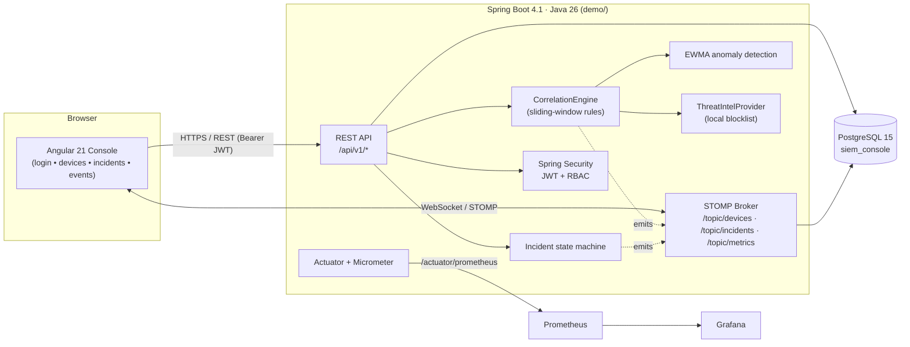

# ⚡ KRON — Enterprise Network Security & SIEM Console


Kurum içi ağ altyapısındaki (Firewall, Server, Router, Switch) cihazların erişilebilirlik durumunu, ping gecikmelerini (latency) ve stabilite trendlerini **gerçek zamanlı** izleyen; dış kaynaklardan gelen olayları (event) korelasyon kurallarıyla analiz edip incident üreten, rol tabanlı erişim kontrolüne sahip bir **SOC (Security Operations Center)** konsolu.

Proje, bir "ping paneli" olmanın ötesine geçti: kural tabanlı bir korelasyon motoru, tam bir incident yaşam döngüsü (durum makinesi + audit trail), JWT tabanlı kimlik doğrulama ve rol yetkilendirmesi (ADMIN/ANALYST/VIEWER), WebSocket/STOMP üzerinden anlık veri akışı ve Prometheus/Grafana ile gözlemlenebilirlik içeren, kurumsal mühendislik disipliniyle (Temiz Kod, katmanlı mimari, kapsayıcı hata yönetimi) geliştirilen bir sistemdir.

---

## 🚀 Öne Çıkan Mühendislik Özellikleri & Mimari

### 1. Kural Tabanlı Korelasyon Motoru
`CorrelationEngine`, olayları koda gömülü mantık yerine veritabanındaki `Rule` kayıtlarına göre değerlendirir. Kayan zaman penceresi (sliding window) hesaplaması bellek içi bir önbellek (Caffeine) üzerinden yapılır; her olay için senkron bir veritabanı sorgusu atılmaz.

### 2. Tam Incident Yaşam Döngüsü
Bir incident `OPEN → ACKNOWLEDGED → IN_PROGRESS → RESOLVED → CLOSED` durum makinesini izler; geçersiz bir geçiş (örn. doğrudan `OPEN → CLOSED`) reddedilir. Severity (INFO/LOW/MEDIUM/HIGH/CRITICAL), yorumlar (`IncidentComment`) ve tam audit trail ile birlikte gelir.

### 3. Gerçek Zamanlı Olay Akışı (WebSocket/STOMP)
Cihaz durum değişiklikleri, yeni incident'ler ve canlı metrikler `/topic/devices`, `/topic/incidents` ve `/topic/metrics` üzerinden anlık olarak istemciye push edilir; bağlantı düşerse Angular tarafındaki `RealtimeService` yeniden bağlanmayı dener.

### 4. Olay Alım (Event Ingestion) API'si
Yalnızca ping değil; dış kaynaklardan normalize edilmiş güvenlik olayları `POST /api/v1/events` ile kabul edilir, hız sınırlaması (Bucket4j) uygulanır ve korelasyon motorundan geçer. Olay önce kalıcı hale getirilir, korelasyon değerlendirmesi ondan sonra yapılır — bir korelasyon hatası kaydın kendisini asla kaybettirmez.

### 5. Gerçek Kimlik Doğrulama ve Yetkilendirme
Spring Security + JWT (access/refresh token çifti). Hassas her uç noktada method-level `@PreAuthorize` gerçek bir yetki sınırıdır; Angular tarafındaki route guard ve rol bazlı arayüz gizleme yalnızca kullanıcı deneyimi katmanıdır, güvenlik sınırı orada değildir.

### 6. Merkezi Hata Yönetimi (RFC 7807)
API hataları `ProblemDetail` (RFC 7807 Problem Details) formatında döner; frontend interceptor ham sunucu mesajını değil, hata koduna karşılık gelen kullanıcıya uygun mesajı gösterir.

---

## 🗺️ Mimari Diyagram



Büyük mimari kararların gerekçesi (neden PostgreSQL, neden WebSocket/STOMP, görsel kimlik) `docs/adr/` altındadır — bkz. [Further reading](#-further-reading--adrs).

---

## 📂 Proje Yapısı (Monorepo)

```
demo/                  Spring Boot 4.1 backend (Java 26, Maven wrapper)
  src/main/java/com/example/demo/
    device/             cihaz CRUD, tarama, sorgu API'leri
    incident/           incident yaşam döngüsü, durum makinesi, yorumlar
    correlation/         CorrelationEngine, Rule, threat-intel sağlayıcısı
    ingestion/          POST /api/v1/events olay alım uç noktası
    anomaly/            EWMA tabanlı latency anomali tespiti
    realtime/           STOMP/WebSocket yapılandırması ve yayıncıları
    security/           JWT auth, filtreler, rol tabanlı yetkilendirme
    metrics/            Micrometer özel metrikleri
    common/, config/    paylaşılan altyapı, DTO/mapper desteği, konfigürasyon

network-ui/             Angular 21 standalone konsol (TypeScript, RxJS, STOMP.js)
  src/app/
    features/auth/      login ekranı
    features/console/   SOC konsolu (devices, incidents, events, ...)
    services/           HTTP + WebSocket servisleri, guard'lar, interceptor'lar

docs/
  adr/                  mimari karar kayıtları (ADR)
  grafana/              içe aktarılabilir Grafana dashboard JSON'u
  design/               tasarım token'ları (CSS custom properties)

docker-compose.yml      postgres + backend + frontend + prometheus + grafana
prometheus.yml          Prometheus scrape config
.github/workflows/      CI pipeline (build, test, docker image, bağımlılık taraması)
```

---

## 🛠️ Teknoloji Yığını / Tech Stack

Versions below are read directly from `demo/pom.xml` and `network-ui/package.json` — not assumed.

**Backend**
| Component | Version |
|---|---|
| Java | 26 (Temurin) |
| Spring Boot | 4.1.0 |
| Build tool | Maven (wrapper, `./mvnw`) |
| Database | PostgreSQL 15 (via `spring-boot-starter-flyway` + `flyway-database-postgresql`) |
| Dev fallback DB | H2 (in-memory, isolated `h2` profile) |
| Entity ↔ DTO mapping | MapStruct 1.6.3 |
| Scheduler locking | ShedLock 7.9.0 (JDBC-backed) |
| Auth tokens | JJWT 0.13.0 |
| Rate limiting | Bucket4j 8.19.0 (`bucket4j_jdk17-core`) |
| Correlation window cache | Caffeine |
| Observability | Spring Boot Actuator + Micrometer (Prometheus registry) |
| Testing | JUnit 5, Mockito, Spring Security Test, MockMvc (`spring-boot-starter-webmvc-test`) |

**Frontend**
| Component | Version |
|---|---|
| Angular | 21.2 (standalone components) |
| TypeScript | 5.9 |
| RxJS | 7.8 |
| Real-time transport | `@stomp/stompjs` 7.3 + `sockjs-client` 1.6 |
| Test runner | Vitest 4, via Angular's own `@angular/build:unit-test` wrapper (`npm test` / `ng test` — **not** `npx vitest run` directly, which skips the zone.js/TestBed setup Angular wires in) |
| Formatting | Prettier 3.8 (config present; not yet wired into a CI gate) |

**Infrastructure**
| Component | Version / Image |
|---|---|
| PostgreSQL | `postgres:15-alpine` |
| Prometheus | `prom/prometheus:latest` |
| Grafana | `grafana/grafana:latest` |
| Frontend web server | `nginx:alpine` (multi-stage build serving the compiled Angular bundle) |

> API documentation (springdoc-openapi / Swagger UI) is planned but not wired into `demo/pom.xml` yet — there is currently no `/swagger-ui.html` to reach. The curl examples below are the accurate current reference until that lands.

---

## ⚙️ Setup

### Prerequisites
- **JDK 26** (Temurin) — matches `demo/pom.xml`'s `<java.version>26</java.version>`. Running the build without it fails at the compile step with `release version 26 not supported`.
- **Node.js 22.12+** (or 20.19+ / 24+) — the range `@angular/cli` itself declares (`engines.node`); anything outside it is not a supported combination for Angular 21's CLI.
- **Docker** and **Docker Compose** (v2, the `docker compose` subcommand).

### Run everything with Docker Compose

```bash
# 1. Create your local env file from the template and fill in real values
cp .env.example .env
# edit .env: POSTGRES_PASSWORD, JWT_SECRET (>= 32 bytes), SIEM_ADMIN_PASSWORD

# 2. Build and start the full stack
docker compose up --build -d

# 3. Check everything is up
docker compose ps
```

Once the stack is up:

| Service | URL | Notes |
|---|---|---|
| Console (frontend) | http://localhost | Angular app served by nginx; redirects to `/login` when unauthenticated |
| Backend API | http://localhost:8080/api/v1/... | see [API examples](#-api-examples) below |
| Backend metrics (Prometheus format) | http://localhost:8080/actuator/prometheus | intentionally left unauthenticated — reachable only inside the compose network, scraped by Prometheus |
| Prometheus | http://localhost:9090 | scrapes the backend per `prometheus.yml` |
| Grafana | http://localhost:3000 | default `admin`/`admin` on first login; import `docs/grafana/siem-dashboard.json` to get the pre-built SIEM dashboard |

The application bootstraps a single `admin` account (`Role.ADMIN`) on first startup if the user table is empty, using `SIEM_ADMIN_PASSWORD` from your `.env` — change it before any real use, the compose file falls back to a well-known development-only value if it's left unset.

### Run backend and frontend locally (without Docker)

```bash
# Backend — needs a reachable PostgreSQL (either the compose siem-db
# service published on a host port, or point SPRING_DATASOURCE_URL at your own)
cd demo
./mvnw spring-boot:run

# Frontend
cd network-ui
npm ci
npm start
```

---

## 📡 API Examples

All examples below use endpoints and request/response shapes read directly from the current controller and record definitions (`AuthController`, `IncidentController`, `IngestionController`) — not invented.

### Authenticate

```bash
curl -X POST http://localhost:8080/api/v1/auth/login \
  -H "Content-Type: application/json" \
  -d '{"username":"admin","password":"<your SIEM_ADMIN_PASSWORD>"}'
```

Response (`TokenResponse`):

```json
{
  "accessToken": "eyJhbGciOiJIUzI1NiJ9...",
  "refreshToken": "eyJhbGciOiJIUzI1NiJ9...",
  "expiresIn": 900
}
```

`expiresIn` is the access token's lifetime in seconds (default 15 minutes, configurable via `siem.jwt.access-token-ttl`). A rejected login — unknown user, wrong password, or a bad refresh token at `/api/v1/auth/refresh` — always answers with the same 401 `INVALID_CREDENTIALS` problem document, deliberately not distinguishing which.

### List open incidents (authenticated)

```bash
curl http://localhost:8080/api/v1/incidents?status=OPEN \
  -H "Authorization: Bearer <accessToken>"
```

### Acknowledge an incident (requires ANALYST or ADMIN role)

```bash
curl -X POST http://localhost:8080/api/v1/incidents/1/transition \
  -H "Authorization: Bearer <accessToken>" \
  -H "Content-Type: application/json" \
  -d '{"newStatus":"ACKNOWLEDGED"}'
```

An illegal transition (e.g. straight to `CLOSED` from `OPEN`) is rejected with a 409 problem document; a caller without `ANALYST`/`ADMIN` gets a 403.

### Submit a normalized security event for correlation

```bash
curl -X POST http://localhost:8080/api/v1/events \
  -H "Authorization: Bearer <accessToken>" \
  -H "Content-Type: application/json" \
  -d '{
        "source": "edge-firewall-01",
        "category": "AUTH_FAILURE",
        "severity": "HIGH",
        "rawPayload": "Failed SSH login for root from 203.0.113.7"
      }'
```

`severity` and `occurredAt` are optional — they default to `INFO` and the moment of receipt respectively. The event is persisted first and evaluated by the correlation engine second, so a correlation failure never costs the stored evidence.

### Manage correlation rules (list is open to any authenticated role, writes require ADMIN)

```bash
curl http://localhost:8080/api/v1/rules \
  -H "Authorization: Bearer <accessToken>"

curl -X POST http://localhost:8080/api/v1/rules \
  -H "Authorization: Bearer <adminAccessToken>" \
  -H "Content-Type: application/json" \
  -d '{
        "name": "Same-subnet simultaneous outage",
        "enabled": true,
        "conditionJson": "{\"type\":\"subnet_outage\",\"downStatuses\":[\"INACTIVE\"],\"prefixOctets\":3}",
        "thresholdCount": 3,
        "windowSeconds": 300,
        "severity": "HIGH"
      }'
```

Rules are data (rows in the `correlation_rule` table, including the built-in seeded ones), never hardcoded logic — this endpoint is the only place outside a migration or the seed that writes them. `conditionJson` always carries a `type` discriminator (`flap`, `subnet_outage`, `latency_anomaly`, `event_burst`); `thresholdCount` and `windowSeconds` are the shared "how many, over what period" parameters every type uses.

---

## 🔐 Roles

| Role | Can do |
|---|---|
| `VIEWER` | Read devices, incidents, events, metrics, correlation rules |
| `ANALYST` | Everything `VIEWER` can, plus acknowledge/transition incidents and add comments |
| `ADMIN` | Everything `ANALYST` can, plus create/update/delete correlation rules and other administrative actions |

Angular route guards and role-based UI hiding are a UX convenience only — the real boundary is the backend's method-level `@PreAuthorize`.

---

## 🖼️ Screenshots

<!-- TODO: screenshot of the Overview / KPI dashboard -->
<!-- TODO: screenshot of the Devices table with the latency detail drawer -->
<!-- TODO: screenshot of the Incidents view showing a state transition -->
<!-- TODO: screenshot of the live Events stream -->
<!-- TODO: screenshot of the imported Grafana dashboard -->

---

## 📖 Further reading / ADRs

- [`docs/adr/0001-use-postgresql.md`](docs/adr/0001-use-postgresql.md) — why PostgreSQL over the original H2 setup
- [`docs/adr/0002-websocket-stomp-for-realtime.md`](docs/adr/0002-websocket-stomp-for-realtime.md) — why WebSocket/STOMP over RxJS polling
- [`docs/adr/0003-visual-identity-tactical-telemetry.md`](docs/adr/0003-visual-identity-tactical-telemetry.md) — the dark SOC visual identity
- [`docs/grafana/siem-dashboard.json`](docs/grafana/siem-dashboard.json) — importable Grafana dashboard for the metrics this console exposes

---

👨‍💻 Geliştirici İletişim

Ayberk Arda

Software Developer | Computer Programming, Istanbul Kültür University (İKÜ)
