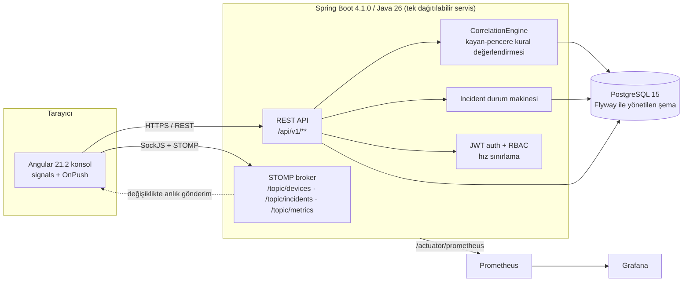

# Enterprise Network SIEM Console

*Main language / Ana dil: [readme.md](readme.md) (English)*

Bir ağ operasyon ekibi için kendi sunucunuzda barındırılan, modüler-monolitik
bir SIEM (Security Information and Event Management) konsolu: cihazları
izler, ham sinyalleri gerçek bir yaşam döngüsüne sahip incident'lara
(olaylara) dönüştürür, WebSocket üzerinden canlı bir SOC panosuna anlık
güncelleme yollar ve her hassas aksiyonu rol tabanlı kimlik doğrulamanın
arkasına kilitler.

Proje küçük bir cihaz-ping izleyici ve denetim (audit) kaydı olarak
başladı. Zamanla sertleştirilmiş bir backend'e (Spring Boot 4.1.0 / Java 26)
ve kural tabanlı bir korelasyon motoru, gerçek bir incident durum makinesi,
olay (event) alımı, gecikme anomali tespiti ve JWT/RBAC güvenliğine sahip bir
Angular 21.2 frontend'ine dönüştü — hepsi tek bir dağıtılabilir servis ve
destekleyici altyapısı (PostgreSQL, Prometheus, Grafana) olarak çalışıyor;
mesaj kuyruğu veya mikroservis mimarisi yok.

## İçindekiler

- [Mimari](#mimari)
- [Öne çıkan özellikler](#öne-çıkan-özellikler)
- [Teknoloji yığını](#teknoloji-yığını)
- [Depo düzeni](#depo-düzeni)
- [Başlarken (Docker Compose)](#başlarken-docker-compose)
- [Yerel geliştirme](#yerel-geliştirme)
- [API özeti](#api-özeti)
- [Gerçek zamanlı kanal](#gerçek-zamanlı-kanal)
- [Testler](#testler)
- [CI/CD](#cicd)
- [İzleme (Monitoring)](#i̇zleme-monitoring)
- [Mimari kararlar](#mimari-kararlar)
- [Güvenlik notları](#güvenlik-notları)
- [Ekran Görüntüleri](#ekran-görüntüleri)
- [Lisans](#lisans)

## Mimari



Korelasyon motoru kurallarını koddan değil veritabanından okur
(`correlation_rule` tablosu) — kayan pencere (sliding-window) değerlendirmesi
bellek içinde çalışır (olay başına veritabanı sorgusu yoktur) ve bir operatör
Rules ekranından çalışma zamanında bir kural ekleyebilir, düzenleyebilir veya
devre dışı bırakabilir. Incident'lar sabit bir yaşam döngüsünden geçer
(`OPEN → ACKNOWLEDGED → IN_PROGRESS → RESOLVED → CLOSED`); geçersiz bir geçiş
(ör. doğrudan `CLOSED`'a atlamak) reddedilir ve her geçiş denetim (audit)
kaydına yazılır.

## Öne çıkan özellikler

- **Cihaz envanteri ve izleme** — cihaz kaydet, isteğe bağlı veya
  zamanlanmış erişilebilirlik kontrolleri çalıştır (sanal thread'lerle
  paralelleştirilmiş tarama sayesinde tarama süresi cihaz sayısıyla doğrusal
  büyümez) ve gerçek kötü niyetli trafiğe ihtiyaç duymadan tespiti
  gösterebilmek için küçük, yerleşik bir saldırı/SSH-bruteforce simülatörü.
- **Korelasyon motoru** — veri olarak saklanan kurallar (cihaz flap'lenmesi,
  aynı subnet'te kesinti, gecikme anomalisi, olay patlaması), bellek içi
  kayan pencereye karşı değerlendirilir; tanınmayan veya hatalı biçimlendirilmiş
  bir kural koşulu, sessizce hiç tetiklenmemek yerine yazılırken reddedilir.
- **Incident yaşam döngüsü** — yorumlara, MITRE ATT&CK teknik etiketlemesine,
  önem derecesine ve bir atanan kişi alanına sahip gerçek bir durum makinesi;
  her durum değişikliği denetlenir.
- **Olay (event) alımı** — beyaz listeye alınmış, normalize edilmiş, hız
  sınırlı bir `POST /api/v1/events` uç noktası korelasyon motorunu besler.
- **Gecikme anomali tespiti** — cihaz başına EWMA tabanlı bir taban çizgisi
  anormal gecikmeyi işaretler; cihaz başına gecikme geçmişi tutulur ve
  zamanlanmış olarak temizlenir (purge).
- **Tehdit istihbaratı** — kodun geri kalanının asla doğrudan konuşmadığı,
  soyutlanmış bir `ThreatIntelProvider` (bugün için yerel bir IP-itibar kara
  listesi) — ileride gerçek bir dış kaynak buraya eklenebilir.
- **Gerçek zamanlı gönderim** — cihazlar, incident'lar ve metrikler için
  CONNECT frame'inde kimliği doğrulanan WebSocket/STOMP topic'leri; soket
  ayakta kalamazsa frontend polling'e geri döner.
- **Kimlik doğrulama ve RBAC** — JWT access/refresh token'ları, üç rol
  (`ADMIN` / `ANALYST` / `VIEWER`), backend'de `@PreAuthorize` ile
  zorlanır (UI'ın kendi rol tabanlı gizlemesi yalnızca bir kolaylıktır,
  güvenlik sınırı değildir).
- **Koyu SOC temalı konsol** — signals + `OnPush` change detection, canlı bir
  tehdit seviyesi göstergesi, cihaz başına gecikme sparkline'ı, incident
  trendi ve önem derecesi dağılımı grafikleri (harici bir grafik kütüphanesi
  olmadan elle yazılmış inline SVG) ve bir incident yorum akışı.
- **Gözlemlenebilirlik** — Micrometer metrikleri (tarama süresi, açık
  incident sayısı, alım hızı) ve içe aktarılabilir bir Grafana panosu.
- **Demo verisi** — tek seferlik, kapatılabilir bir tohumlayıcı, taze bir
  checkout'a boş bir gösterge paneli yerine dokuz gerçekçi cihaz verir.

## Teknoloji yığını

| Katman | Teknoloji |
|---|---|
| Backend | Spring Boot 4.1.0, Java 26, Spring Security, Spring Data JPA, Spring WebSocket (STOMP), Flyway, MapStruct, ShedLock, Bucket4j, springdoc-openapi |
| Frontend | Angular 21.2 (standalone component'ler, signals), TypeScript 5.9, RxJS 7.8, `@stomp/stompjs` + `sockjs-client` |
| Veritabanı | PostgreSQL 15 (Flyway ile versiyonlanmış şema); test profili için bellek içi H2 |
| Test | JUnit 5, Mockito, Testcontainers (backend); Angular'ın test builder'ı üzerinden Vitest 4, Playwright (frontend) |
| Kod kalitesi | Spotless + palantir-java-format (backend), `@angular-eslint` ile ESLint (frontend) |
| Altyapı | Docker Compose, Prometheus, Grafana |

## Depo düzeni

```
demo/                 Spring Boot backend (Maven wrapper: ./mvnw)
  src/main/java/com/example/demo/
    device/            cihaz envanteri, tarama, gecikme geçmişi
    incident/          incident entity'si, durum makinesi, yorumlar
    correlation/       CorrelationEngine, Rule, tehdit-istihbaratı sağlayıcısı
    ingestion/         olay alım API'si
    anomaly/           EWMA gecikme taban çizgisi
    realtime/          STOMP gönderimi (cihazlar/incident'lar/metrikler)
    security/          JWT, RBAC, STOMP CONNECT auth, hız sınırlama
    metrics/           özel Micrometer metrikleri
    config/            güvenlik, WebSocket, scheduler-lock konfigürasyonu
    common/            paylaşılan DTO'lar, hata yönetimi (RFC 7807 ProblemDetail)
  src/main/resources/db/migration/   Flyway migration'ları (V1 baseline .. V8)
network-ui/            Angular frontend
  src/app/features/    login, konsol (genel bakış/cihazlar/incident'lar/kurallar/loglar)
  src/app/services/    tipli REST istemcisi, gerçek zamanlı (STOMP) servisi, auth
  src/app/shared/      grafik component'leri, tasarım token'ları
  e2e/                 Playwright duman (smoke) testi
docs/
  adr/                 mimari karar kayıtları
  grafana/             içe aktarılabilir pano JSON'u
docker-compose.yml     postgres + backend + frontend + prometheus + grafana
prometheus.yml         scrape konfigürasyonu
```

## Başlarken (Docker Compose)

```bash
cp .env.example .env
# .env dosyasını düzenleyin: yerel denemenin ötesinde bir kullanım öncesi
# gerçek bir POSTGRES_PASSWORD, JWT_SECRET (en az 32 byte) ve
# SIEM_ADMIN_PASSWORD ayarlayın

docker compose up --build
```

| Servis | URL |
|---|---|
| Konsol (frontend) | http://localhost |
| Backend API | http://localhost:8080 |
| Swagger UI | http://localhost:8080/swagger-ui.html |
| Prometheus | http://localhost:9090 |
| Grafana | http://localhost:3000 |

İlk açılışta backend, `SIEM_ADMIN_PASSWORD` ile bir `admin` hesabı
oluşturur (ayarlanmamışsa `changeme-on-first-login`'e düşer — bunu
geçici/yerel bir koşum dışında varsayılan bırakmayın).

## Yerel geliştirme

İki yarıyı Docker olmadan çalıştırmak (hızlı yineleme veya e2e paketi için
kullanışlı) kendi kendine yeterli `h2` profilini kullanır, yani bir veritabanı
konteynerine gerek yoktur:

```bash
# backend — JDK 26 gerektirir
cd demo
./mvnw spring-boot:run -Dspring-boot.run.profiles=h2

# frontend, ikinci bir terminalde
cd network-ui
npm ci
npm start   # ng serve, http://localhost:4200
```

`h2` profili, bellek içi veritabanı her başlangıçta boş olduğu için otomatik
olarak dokuz demo cihazı tohumlar ve `admin` / `changeme-on-first-login`
hesabını oluşturur.

Bir profil **açıkça** seçilmelidir (`h2` veya `postgres`) — ikisi Flyway
migration'ları için farklı SQL lehçeleri kullanır ve şu an bir varsayılan
fallback yoktur.

## API özeti

`v1` API'sinden önce gelen ve hâlâ `/api/devices/**` altında yaşayan orijinal
cihaz CRUD/simülatör uç noktaları dışında tüm uç noktalar `/api/v1/**` altında
versiyonlanmıştır. Hatalar [RFC 7807](https://www.rfc-editor.org/rfc/rfc7807)
`ProblemDetail` belgeleri olarak döner.

| Uç Nokta | Metot | Rol | Not |
|---|---|---|---|
| `/api/v1/auth/login`, `/api/v1/auth/refresh` | POST | herkese açık | JWT access+refresh token'ları verir/yeniler |
| `/api/v1/devices` | GET, POST | herhangi bir kimliği doğrulanmış kullanıcı | filtrelenebilir/sayfalanabilir cihaz listesi |
| `/api/v1/devices/{id}/latency` | GET | herhangi bir kimliği doğrulanmış kullanıcı | gecikme geçmişi, `limit` 1–1000, varsayılan 100 |
| `/api/v1/incidents` | GET, POST | herhangi bir kimliği doğrulanmış kullanıcı | statü/önem derecesine göre filtrele |
| `/api/v1/incidents/{id}/transition` | POST | `ANALYST`, `ADMIN` | seferde bir yaşam döngüsü adımı |
| `/api/v1/incidents/{id}/comments` | GET, POST | GET: herkes · POST: `ANALYST`, `ADMIN` | bir incident üzerindeki analist notları |
| `/api/v1/events` | POST, GET | herhangi bir kimliği doğrulanmış kullanıcı | hız sınırlı alım (~20 istek/sn/IP) |
| `/api/v1/rules` | GET, POST, PUT, DELETE | GET: herkes · yazma: `ADMIN` | korelasyon kuralı CRUD'u |
| `/api/devices`, `/api/devices/{id}/attack`, `/api/devices/{id}/ssh-bruteforce` | çeşitli | `ANALYST`, `ADMIN` (değişiklikler) | orijinal cihaz yönetimi + yerleşik saldırı simülatörü |

Tam istek/yanıt şekilleri, backend çalışırken OpenAPI şemasında
(`/v3/api-docs`) / Swagger UI'da (`/swagger-ui.html`) bulunabilir.

```bash
# Giriş yap ve korunan bir uç noktayı çağır
curl -X POST http://localhost:8080/api/v1/auth/login \
  -H "Content-Type: application/json" \
  -d '{"username":"admin","password":"<SIEM_ADMIN_PASSWORD değeriniz>"}'

curl http://localhost:8080/api/v1/incidents \
  -H "Authorization: Bearer <accessToken>"
```

## Gerçek zamanlı kanal

Frontend, SockJS üzerinden `/ws-siem`'e bağlanır ve STOMP topic'lerine abone
olur; bearer token bir STOMP `CONNECT` header'ı olarak taşınır (tarayıcılar
bir WebSocket handshake'ine normal bir `Authorization` header'ı ekleyemez) ve
sunucu bu token eksik veya geçersizse CONNECT frame'ini tamamen reddeder —
hiçbir topic'e anonim abonelik yoktur.

| Topic | Payload |
|---|---|
| `/topic/devices` | cihaz statü/gecikme değişikliği |
| `/topic/incidents` | oluşturulan/geçiş yapan incident |
| `/topic/metrics` | canlı tarama süresi / açık-incident / alım-hızı anlık görüntüsü |

Soket, tekrarlanan geri çekilme (backoff) denemelerinden sonra kurulamazsa,
konsol sessizce bayatlamak yerine REST polling'e geri döner.

## Testler

```bash
# backend — birim + Testcontainers destekli entegrasyon testleri
cd demo && ./mvnw verify

# frontend — birim testleri (ham Vitest değil, Angular'ın kendi test builder'ı üzerinden)
cd network-ui && npm test

# frontend — build
cd network-ui && npx ng build

# uçtan uca duman (smoke) testi (hem backend'i hem dev sunucusunu kendisi başlatır)
cd network-ui && npm run e2e
```

Playwright paketi, spec'in istediği duman akışını kapsar: her iki yarının da
gerçekten çalışan bir örneğine karşı giriş yap, bir cihaz kaydet ve bir
incident'ı onayla (acknowledge).

## CI/CD

`.github/workflows/ci.yml`, `main`'e her push/PR'da çalışır:

- **build-backend** — `mvnw verify` (JUnit 5 + Mockito + Testcontainers)
- **build-frontend** — `npm ci`, birim testleri, prod build
- **lint** — Spotless format kontrolü (backend) ve ESLint (frontend, şu an
  bloklayıcı değil — gerekçesi workflow dosyasındaki notta)
- **docker-build** — her iki uygulama imajını da derler ve
  `docker-compose.yml`'i doğrular
- **dependency-scan** — OWASP Dependency-Check ve `npm audit`, ikisi de
  bilgilendirici

## İzleme (Monitoring)

Micrometer metrikleri `/actuator/prometheus`'ta sunulur ve paketlenmiş
Prometheus servisi tarafından toplanır (scrape). `docs/grafana/siem-dashboard.json`,
tarama süresini, açık incident sayısını ve olay alım hızını kapsayan içe
aktarılabilir bir Grafana panosudur.

## Mimari kararlar

Daha büyük, geri alınması daha zor kararlar `docs/adr/` altında kayıtlıdır:

- [0001 — PostgreSQL kullanımı](docs/adr/0001-use-postgresql.md)
- [0002 — Gerçek zamanlı güncellemeler için WebSocket/STOMP](docs/adr/0002-websocket-stomp-for-realtime.md)
- [0003 — Görsel kimlik ("taktik telemetri")](docs/adr/0003-visual-identity-tactical-telemetry.md)

## Güvenlik notları

- Sizden başka herhangi biri tarafından erişilebilir herhangi bir yerde
  çalıştırmadan önce `SIEM_ADMIN_PASSWORD`, `POSTGRES_PASSWORD` ve
  `JWT_SECRET`'i değiştirin — `.env.example`'daki değerler yer tutucudur,
  gerçek kullanım için varsayılan değildir.
- Backend'deki metot seviyesi `@PreAuthorize` gerçek güvenlik sınırıdır;
  frontend'in role göre gizlediği veya devre dışı bıraktığı her şey yalnızca
  bir kolaylıktır.
- `/actuator/prometheus` bilerek kimlik doğrulamasız bırakılmıştır — yalnızca
  Prometheus'tan özel `docker-compose` ağı üzerinden erişilebilir, hiçbir
  zaman genel bir arayüzden değil. Bu ağ varsayımı değişirse bu yeniden
  gözden geçirilmelidir.

## Ekran Görüntüleri

| | |
|---|---|
| **Giriş** |  |
| **Genel Bakış** — canlı tehdit seviyesi, KPI kartları, trend/önem derecesi/uptime grafikleri |  |
| **Cihazlar** — envanter, aksiyonlar, cihaz başına gecikme geçmişi |  |
| **Olaylar** — yaşam döngüsü aksiyonları ve yorum akışı |  |
| **Kurallar** — korelasyon kuralı CRUD'u |  |

## Lisans

Aşağıdakilerden herhangi biri altında çift lisanslıdır:

- [MIT Lisansı](LICENSE-MIT)
- [Apache Lisansı, Sürüm 2.0](LICENSE-APACHE)

tercihinize bağlı olarak.

---

*Kapsam dışı, tasarım gereği: bu proje tek bir modüler monolit olarak kalır —
mesaj kuyruğu yok, mikroservislere bölünme yok.*
